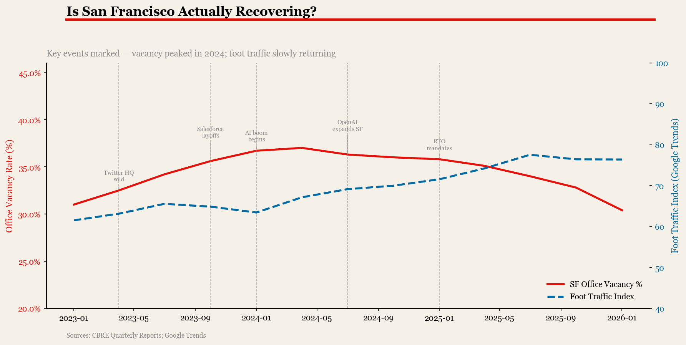
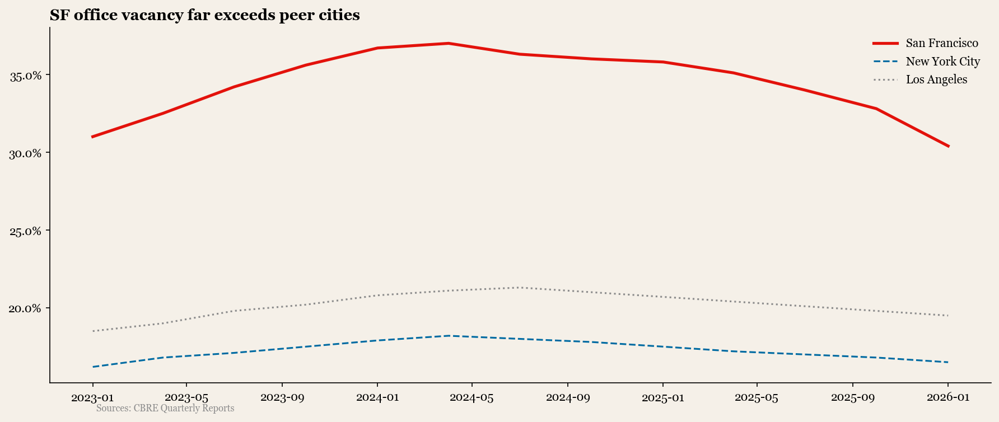
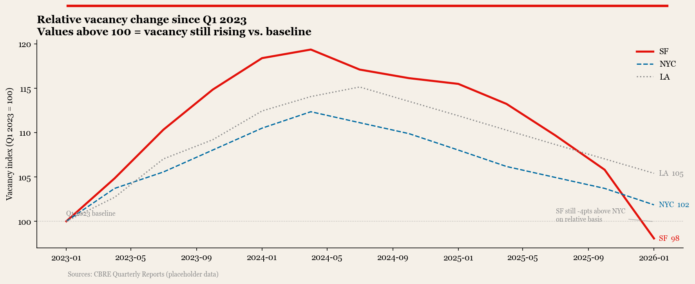
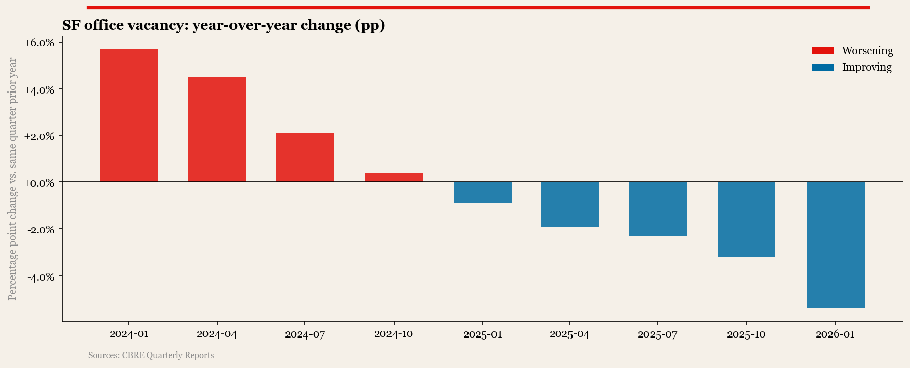
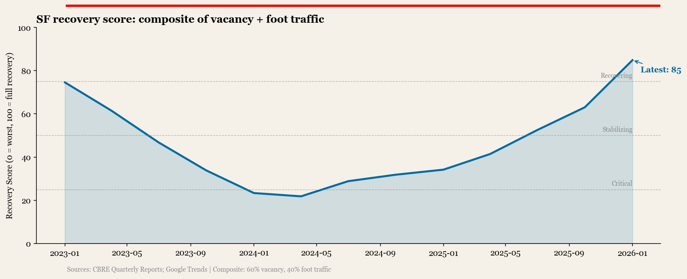

# Is San Francisco Actually Recovering?
### Office Vacancy vs. Foot Traffic, 2023–2026

---

## The Question

SF has dominated "city decline" headlines since 2020. But what does the data actually say in 2026? This project combines office vacancy rates with foot traffic trends to separate narrative from reality.

## Key Finding

> SF office vacancy peaked at **37.0% in Q2 2024** — the highest ever recorded. By Q1 2026 it had fallen to **30.4%**, a 6.6 percentage point drop driven largely by AI company leasing. Recovery is real but uneven: vacancy is still 6× higher than the pre-pandemic low of 4.7%.

---

## Charts

### 1. Vacancy + Foot Traffic (annotated)
*Dual-axis view with key market events marked*



---

### 2. SF vs. Peer Cities
*SF vacancy far exceeds NYC and LA throughout the period*



---

### 3. Normalized City Trajectories
*All cities indexed to Q1 2023 = 100, showing relative pace of change*



---

### 4. Year-over-Year Vacancy Change
*Red = worsening, Blue = improving — turning point visible in 2024*



---

### 5. SF Recovery Score (Composite Index)
*60% vacancy improvement + 40% foot traffic — single 0–100 score*



## Data Sources

| Source | Data | Link |
|--------|------|-------|
| CBRE / Cushman & Wakefield | Office vacancy rates (quarterly) | Public reports |
| U.S. Census / BLS | Employment by sector, SF County | data.census.gov |
| Google Trends | Search interest: "San Francisco office", "SF restaurants" | trends.google.com |
| OpenTable | Restaurant reservation index | restaurant.opentable.com/state-of-industry |

## Method

1. Collected quarterly office vacancy rate (% of total SF office space)
2. Indexed foot traffic using Google Trends as proxy (normalized to 100 = Jan 2020)
3. Compared trajectory against other major metros (NYC, LA, Chicago) as baseline
4. Identified divergence points — where narrative and data split

## Repo Structure

```
dj-sf-recovery-2026/
├── README.md
├── analysis.ipynb
├── data/
│   └── raw/                    ← source CSVs (gitignored)
└── charts/
    ├── main_annotated.png
    ├── city_comparison.png
    ├── normalized_cities.png
    ├── yoy_change.png
    └── recovery_score.png
```

## Series

Part of the **Data Journalism** series — one story, one dataset, one chart.

---
*Rahul Kale · Data Analyst · 2026*
