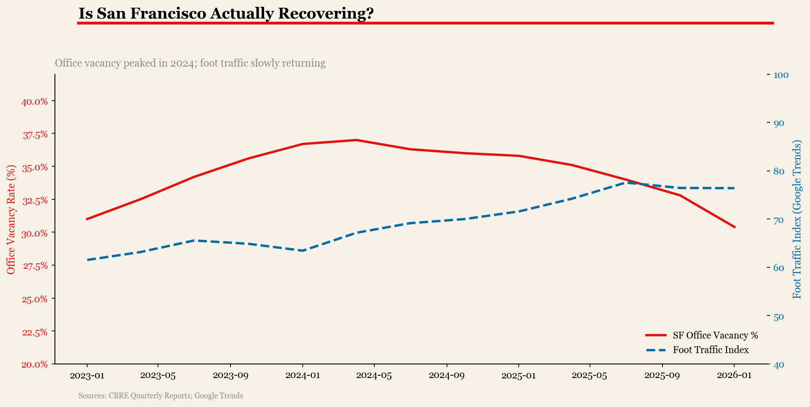

# Is San Francisco Actually Recovering?
### Office Vacancy vs. Foot Traffic, 2023–2026

---

## The Question

SF has dominated "city decline" headlines since 2020. But what does the data actually say in 2026? This project combines office vacancy rates with foot traffic trends to separate narrative from reality.

## Key Finding

> *(To be updated after analysis)*

## Charts



## Data Sources

| Source | Data | Link |
|--------|------|-------|
| CBRE / Cushman & Wakefield | Office vacancy rates (quarterly) | Public reports |
| U.S. Census / BLS | Employment by sector, SF County | data.census.gov |
| Google Trends | Search interest: "San Francisco office", "SF restaurants" | trends.google.com |
| OpenTable | Restaurant reservation index | restaurant.opentable.com/state-of-industry |

## Method

1. Collected quarterly office vacancy rate (% of total SF office space)
2. Indexed foot traffic using Google Trends as proxy (normalized to 100 = Jan 2020)
3. Compared trajectory against other major metros (NYC, LA, Chicago) as baseline
4. Identified divergence points — where narrative and data split

## Repo Structure

```
dj-sf-recovery-2026/
├── README.md
├── analysis.ipynb
├── data/
│   └── raw/          ← source CSVs
└── charts/
    └── main.png      ← key chart
```

## Series

Part of the **Data Journalism** series — one story, one dataset, one chart.

---
*Rahul Kale · Data Analyst · 2026*
